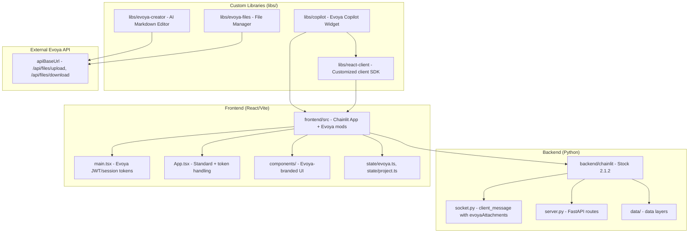

# Evoya — Chainlit Fork Migration Plan

> **Current version:** `2.1.2` (confirmed via [`backend/pyproject.toml`](backend/pyproject.toml:3) and [`backend/chainlit/version.py`](backend/chainlit/version.py:8))
> **Target version:** `2.11.1` (latest upstream Chainlit)
> **Fork strategy:** Heavily customized frontend with custom libraries; backend is close to upstream.

---

## Table of Contents

1. [Executive Summary](#1-executive-summary)
2. [Current Architecture Overview](#2-current-architecture-overview)
3. [Feature Inventory](#3-feature-inventory)
   - 3.1 [Chainlit Core Features](#31-chainlit-core-features)
   - 3.2 [Custom Evoya Features](#32-custom-evoya-features)
4. [Customization Map](#4-customization-map)
   - 4.1 [Backend Modifications](#41-backend-modifications)
   - 4.2 [Frontend Modifications](#42-frontend-modifications)
   - 4.3 [Custom Libraries](#43-custom-libraries)
5. [Upstream Changes (2.1.2 → 2.11.1)](#5-upstream-changes-212--2111)
6. [Migration Strategy](#6-migration-strategy)
7. [Step-by-Step Migration Plan](#7-step-by-step-migration-plan)
8. [Risk Assessment](#8-risk-assessment)
9. [Testing Plan](#9-testing-plan)

---

## 1. Executive Summary

The Evoya codebase is a **fork of Chainlit 2.1.2** with extensive custom frontend libraries built around it. The product "Evoya" is an AI assistant platform with a copilot widget, a markdown creator/editor, a file management system, and a privacy shield feature.

**Key finding:** The backend (`backend/chainlit/`) contains **zero "evoya" references** — it is essentially stock Chainlit 2.1.2. All customizations live in the frontend and the `libs/` directory. This significantly de-risks the backend migration.

**Migration approach:** A **layered rebase strategy** — upgrade the backend to upstream 2.11.1, then re-apply the custom frontend libraries on top of the upgraded Chainlit frontend, resolving conflicts at each integration point.

---

## 2. Current Architecture Overview

### Monorepo Structure (pnpm workspace)

Defined in [`pnpm-workspace.yaml`](pnpm-workspace.yaml:1):

| Package | Path | Purpose |
|---------|------|---------|
| `@chainlit/app` | `frontend/` | Main Chainlit web app with Evoya branding |
| `@chainlit/copilot` | `libs/copilot/` | Embeddable copilot widget with Evoya config |
| `@chainlit/react-client` | `libs/react-client/` | React client SDK with Evoya extensions |
| `@evoya/creator` | `libs/evoya-creator/` | AI markdown editor (Lexical-based) |
| `@evoya/file-picker` | `libs/evoya-files/` | File management widget |

---

## 3. Feature Inventory

### 3.1 Chainlit Core Features

These are the standard Chainlit features present in the 2.1.2 codebase:

#### Backend (Python SDK)
| Feature | File | Description |
|---------|------|-------------|
| Message API | [`message.py`](backend/chainlit/message.py) | `Message`, `AskFileMessage`, `AskActionMessage`, `AskUserMessage`, `ErrorMessage` |
| Step API | [`step.py`](backend/chainlit/step.py) | `Step` class, `@step` decorator for chain-of-thought |
| Elements | [`element.py`](backend/chainlit/element.py) | `Audio`, `CustomElement`, `Dataframe`, `File`, `Image`, `Pdf`, `Plotly`, `Pyplot`, `Task`, `TaskList`, `TaskStatus`, `Text`, `Video` |
| Input Widgets | [`input_widget.py`](backend/chainlit/input_widget.py) | `Switch`, `Slider`, `Select`, `TextInput`, `Tags`, `NumberInput` |
| Chat Settings | [`chat_settings.py`](backend/chainlit/chat_settings.py) | `ChatSettings` class |
| Chat Context | [`chat_context.py`](backend/chainlit/chat_context.py) | `chat_context` for message history |
| User Session | [`user_session.py`](backend/chainlit/user_session.py) | `user_session` proxy |
| Callbacks | [`callbacks.py`](backend/chainlit/callbacks.py) | `on_chat_start`, `on_chat_end`, `on_message`, `on_stop`, `on_chat_resume`, `on_audio_start/end/chunk`, `on_settings_update`, `on_logout`, `on_window_message`, `password_auth_callback`, `oauth_callback`, `header_auth_callback`, `action_callback`, `author_rename`, `set_chat_profiles`, `set_starters`, `send_window_message` |
| Auth | [`auth/`](backend/chainlit/auth/) | JWT, cookie-based auth, OAuth providers |
| Data Layers | [`data/`](backend/chainlit/data/) | SQLAlchemy, DynamoDB, LiteralAI, ACL |
| Storage Clients | [`data/storage_clients/`](backend/chainlit/data/storage_clients/) | S3, Azure Blob, Azure, GCS |
| Integrations | Various | LangChain, LlamaIndex, Haystack, OpenAI, MistralAI, Langflow, Slack, Discord, Teams |
| Socket Server | [`socket.py`](backend/chainlit/socket.py) | WebSocket session management, message routing |
| HTTP Server | [`server.py`](backend/chainlit/server.py) | FastAPI routes, file upload, thread management, feedback |
| Config | [`config.py`](backend/chainlit/config.py) | TOML-based configuration |
| Telemetry | [`telemetry.py`](backend/chainlit/telemetry.py) | Usage tracking |
| Translations | [`translations/`](backend/chainlit/translations/) | Multi-language support (13 languages) |
| Markdown | [`markdown.py`](backend/chainlit/markdown.py) | Markdown processing |
| Sidebar | [`sidebar.py`](backend/chainlit/sidebar.py) | `ElementSidebar` |
| Cache | [`cache.py`](backend/chainlit/cache.py) | Caching support |
| Secret | [`secret.py`](backend/chainlit/secret.py) | Secret generation |
| Sync | [`sync.py`](backend/chainlit/sync.py) | `run_sync`, `make_async` |

#### Frontend (React)
| Feature | Area | Description |
|---------|------|-------------|
| Chat Interface | `components/chat/` | Message composer, messages, scroll, starters, welcome screen |
| Message Rendering | `components/chat/Messages/` | User messages, assistant steps, tool steps, CoT |
| Elements | `components/Elements/` | Audio, Dataframe, File, Image, PDF, Plotly, Text, Video |
| Thread History | `components/LeftSidebar/` | Thread list, search, thread options |
| Chat Settings | `components/ChatSettings/` | Settings modal with form inputs |
| Header | `components/header/` | User nav, chat profiles, API keys, readme, theme toggle |
| Task List | `components/Tasklist/` | Task tracking UI |
| Auth | `components/LoginForm.tsx`, `pages/Login.tsx` | Login, OAuth provider buttons |
| i18n | `components/i18n/` | Translation system |
| Markdown | `components/Markdown.tsx` | Markdown rendering with KaTeX, Mermaid, code highlighting |
| UI Components | `components/ui/` | Radix UI-based component library (shadcn/ui) |
| Pages | `pages/` | Home, Login, Thread, Element, Env, AuthCallback |
| Router | `router.tsx` | React Router configuration |

### 3.2 Custom Evoya Features

These are the features custom-built on top of Chainlit:

#### A. Evoya Copilot Widget (`libs/copilot/`)
| Feature | File | Description |
|---------|------|-------------|
| **Evoya Config System** | [`evoya/types.ts`](libs/copilot/src/evoya/types.ts:1) | `EvoyaConfig` with container, reset, chat_uuid, session_uuid, type (default/container/dashboard), access token getter, locale, API config, logo, watermark, brand color, additional info, chat bubble, header config, creator config, auto-open, overlay, speech-to-text |
| **Widget Context** | [`context.ts`](libs/copilot/src/context.ts:1) | React context providing `EvoyaConfig` and access token |
| **Widget Mount** | [`index.tsx`](libs/copilot/index.tsx:33) | `mountChainlitWidget(config, evoya)` — Shadow DOM mounting with custom CSS |
| **Auto-Open** | [`widget.tsx`](libs/copilot/src/widget.tsx:73) | Auto-open widget on desktop/mobile with delay, cookie-based tracking |
| **Custom Theme Loading** | [`appWrapper.tsx`](libs/copilot/src/appWrapper.tsx:42) | Fetches `/public/theme.json`, loads custom fonts, Inter fallback |
| **Translation Loading** | [`app.tsx`](libs/copilot/src/app.tsx:73) | Dynamic translation loading from `translations/` directory |
| **Dashboard Mode** | Various | Special `type: 'dashboard'` mode with different UI layout, projects, prompts |
| **Evoya Creator Toggle** | [`app.tsx`](libs/copilot/src/app.tsx:38) | `evoyaCreatorEnabledState` from react-client, forces `cot: 'full'` |

#### B. Privacy Shield (`libs/copilot/src/evoya/privacyShield/`)
| Feature | File | Description |
|---------|------|-------------|
| **Privacy Shield Hook** | [`usePrivacyShield.ts`](libs/copilot/src/evoya/privacyShield/usePrivacyShield.ts:30) | Manages enabled state, sections, categories, locking, text processing |
| **Privacy Shield State** | [`state.ts`](libs/copilot/src/evoya/state.ts:1) | Recoil atoms: enabled, enabledVisual, open, text, loading, sections, currentSections |
| **Create Section** | [`CreateSection.tsx`](libs/copilot/src/evoya/privacyShield/CreateSection.tsx) | UI to create privacy sections |
| **Text Sections** | [`TextSections.tsx`](libs/copilot/src/evoya/privacyShield/TextSections.tsx) | Display/manage text sections |
| **Text Sections Categories** | [`TextSectionsCategories.tsx`](libs/copilot/src/evoya/privacyShield/TextSectionsCategories.tsx) | Categorized text sections |
| **Text Sections Item** | [`TextSectionsItem.tsx`](libs/copilot/src/evoya/privacyShield/TextSectionsItem.tsx) | Individual section item |
| **Privacy Shield Toggle** | [`PrivacyShieldToggle.tsx`](libs/copilot/src/evoya/privacyShield/PrivacyShieldToggle.tsx) | Toggle control |
| **Response Text Item** | [`ResponseTextItem.tsx`](libs/copilot/src/evoya/privacyShield/ResponseTextItem.tsx) | Renders anonymized response text |
| **Integration in Markdown** | [`frontend/src/components/Markdown.tsx`](frontend/src/components/Markdown.tsx:14) | Privacy shield applied to markdown rendering |
| **Integration in Config Menu** | [`frontend/src/components/chat/MessageComposer/ConfigurationMenu.tsx`](frontend/src/components/chat/MessageComposer/ConfigurationMenu.tsx:27) | Privacy shield toggle in configuration |

#### C. Evoya Creator (`libs/evoya-creator/`)
| Feature | File | Description |
|---------|------|-------------|
| **Creator Widget Mount** | [`index.tsx`](libs/evoya-creator/index.tsx:38) | `mountEvoyaCreatorWidget(config)` — Shadow DOM, window globals: `openEvoyaCreator`, `getEvoyaCreatorContent`, `getEvoyaCreatorContentSelection`, `updateEvoyaCreator`, `streamEvoyaCreator` |
| **Creator Config** | [`types.ts`](libs/evoya-creator/src/types.ts:7) | `EvoyaCreatorConfig` with enabled, container, theme, brand_color, apiBaseUrl, csrfToken, workspaceId, isSuperUser |
| **Creator Hook** | [`useEvoyaCreator.ts`](libs/evoya-creator/src/hooks/useEvoyaCreator.ts:23) | `openCreatorWithContent`, `openCreatorWithFile`, `saveCreatorContent` — integrates with external API |
| **Creator Frame** | [`CreatorFrame.tsx`](libs/evoya-creator/src/components/CreatorFrame.tsx) | Main editor container |
| **Creator Chat** | [`CreatorChat.tsx`](libs/evoya-creator/src/components/CreatorChat.tsx) | Chat interface within creator |
| **Creator Header** | [`CreatorHeader.tsx`](libs/evoya-creator/src/components/CreatorHeader.tsx) | Header with toolbar |
| **MDX Editor** | [`markdownEditor/`](libs/evoya-creator/src/components/markdownEditor/) | Lexical-based markdown editor |
| **Evoya AI Plugin** | [`plugins/evoyaAi/`](libs/evoya-creator/src/components/markdownEditor/plugins/evoyaAi/) | AI-powered editing: `CreatorLock`, `DiffNestedLexicalEditor`, `DiffNode`, `TextSelection` |
| **Evoya Image Plugin** | [`plugins/evoyaImage/`](libs/evoya-creator/src/components/markdownEditor/plugins/evoyaImage/) | Image handling in editor |
| **Code Block Plugins** | [`plugins/extend/codeblocks/`](libs/evoya-creator/src/components/markdownEditor/plugins/extend/codeblocks/) | `EvoyaCodeEditor`, `Mermaid`, `VegaLite` rendering |
| **Table Plugin** | [`plugins/extend/table/`](libs/evoya-creator/src/components/markdownEditor/plugins/extend/table/) | `TableEditorWrapper` |
| **Math Plugin** | [`plugins/math/`](libs/evoya-creator/src/components/markdownEditor/plugins/math/) | Math dialog and rendering |
| **Custom Toolbar** | [`plugins/toolbar/`](libs/evoya-creator/src/components/markdownEditor/plugins/toolbar/) | `AutoApproveToggle`, `EvoyaAdvanced`, `EvoyaBlockTypeSelect`, `EvoyaDiffSourceToggleWrapper`, `EvoyaDropdown`, `ExportContent`, `OpenFile`, `ResetDocument`, `SaveContent`, `SelectAll`, `SetDiffSource` |
| **Standalone Editor** | [`markdownEditorStandalone/`](libs/evoya-creator/src/components/markdownEditorStandalone/) | Standalone editor mode |
| **Markdown File Editor** | [`markdownFile/`](libs/evoya-creator/src/components/markdownFile/) | `Editor`, `Toolbar` for file editing |
| **Vega Editor** | [`vegaEditor/`](libs/evoya-creator/src/components/vegaEditor/) | Vega chart editor |

#### D. Evoya Files (`libs/evoya-files/`)
| Feature | File | Description |
|---------|------|-------------|
| **File Widget** | [`widget.tsx`](libs/evoya-files/src/widget.tsx:28) | Main file manager with path navigation, URL state |
| **Compact Widget** | [`widget-compact.tsx`](libs/evoya-files/src/widget-compact.tsx) | Compact file picker mode |
| **File Picker** | [`components/FilePicker.tsx`](libs/evoya-files/src/components/FilePicker.tsx) | File/folder browser |
| **File Picker Item** | [`components/FilePickerItem.tsx`](libs/evoya-files/src/components/FilePickerItem.tsx) | Individual file/folder item |
| **File Search** | [`components/FileSearch.tsx`](libs/evoya-files/src/components/FileSearch.tsx) | File search |
| **Folder Breadcrumbs** | [`components/FolderBreadcrumbs.tsx`](libs/evoya-files/src/components/FolderBreadcrumbs.tsx) | Path navigation |
| **Uploader** | [`components/Uploader.tsx`](libs/evoya-files/src/components/Uploader.tsx) | File upload |
| **Viewers** | [`components/viewer/`](libs/evoya-files/src/components/viewer/) | Audio, Image, Markdown, PDF, Text viewers |
| **File Context** | [`context/file-context.ts`](libs/evoya-files/src/context/file-context.ts) | API base URL, CSRF token, workspace/project IDs |
| **File Types** | [`types/`](libs/evoya-files/src/types/) | `EvoyaFile`, `FilePickerItem`, `PathItem`, directory types |

#### E. Evoya Session Management
| Feature | File | Description |
|---------|------|-------------|
| **Share Session** | [`ShareSessionButton.tsx`](libs/copilot/src/evoya/ShareSessionButton.tsx:100) | Session sharing with org restrictions, `EvoyaShareLink` type, custom select dropdown |
| **Favorite Session** | [`FavoriteSessionButton.tsx`](libs/copilot/src/evoya/FavoriteSessionButton.tsx) | Session favoriting with add/remove API |
| **Dashboard Sidebar** | [`DashboardSidebarButton.tsx`](libs/copilot/src/evoya/DashboardSidebarButton.tsx) | Dashboard navigation button |
| **View Context** | [`ViewContext.tsx`](libs/copilot/src/evoya/ViewContext.tsx:1) | Prompt context viewer with exact/context tabs, Python literal parsing, token boundary detection |

#### F. Evoya Data Processing
| Feature | File | Description |
|---------|------|-------------|
| **Data Processing Popover** | [`DataProcessingPopover.tsx`](frontend/src/components/chat/DataProcessingPopover.tsx:3) | Regional data processing categories (CH, EU, US, OTHER) with flag icons |
| **Additional Info** | [`WaterMark.tsx`](frontend/src/components/WaterMark.tsx:72) | Custom additional info text, links, default text |

#### G. Evoya Attachments & Upload
| Feature | File | Description |
|---------|------|-------------|
| **Evoya Attachments State** | [`state/evoya.ts`](frontend/src/state/evoya.ts:1) | `EvoyaAttachment` with id, path, type, name, remove callback |
| **Evoya File Ref** | [`types/file.ts`](libs/react-client/src/types/file.ts:17) | `IEvoyaFileRef` with path — sent via socket `client_message` |
| **Upload Button Dropdown** | [`UploadButtonDropdown.tsx`](frontend/src/components/chat/MessageComposer/UploadButtonDropdown.tsx:33) | Cloud file attachment via evoya-files picker |
| **File Picker Dialog** | [`FilePickerDialog.tsx`](frontend/src/components/FilePickerDialog.tsx:10) | Dialog wrapper for evoya file picker |
| **Attachment Display** | [`Attachments.tsx`](frontend/src/components/chat/MessageComposer/Attachments.tsx:13) | Renders both standard and evoya attachments |

#### H. Evoya Branding & UI
| Feature | File | Description |
|---------|------|-------------|
| **Custom Watermark** | [`WaterMark.tsx`](frontend/src/components/WaterMark.tsx:8) | Evoya logo, hideable, links to evoya.ai |
| **Evoya Logo** | `assets/evoya_light.svg` | Custom logo asset |
| **Evoya Toast** | [`lib/evoya-toast.ts`](frontend/src/lib/evoya-toast.ts) | Custom toast utility |
| **Evoya Creator Button** | [`EvoyaCreatorButton.tsx`](frontend/src/components/chat/Messages/Message/Buttons/EvoyaCreatorButton.tsx:45) | Button to open creator with message content |
| **Debug Button** | [`DebugButton.tsx`](frontend/src/components/chat/Messages/Message/Buttons/DebugButton.tsx) | Debug button for messages |
| **Tool Step Info** | [`ToolStepInfo.tsx`](frontend/src/components/chat/Messages/Message/ToolStepInfo.tsx:87) | Custom CoT display with evoya translations (thinking, using_tool, processing_document) |
| **Message Display** | [`Message/index.tsx`](frontend/src/components/chat/Messages/Message/index.tsx:98) | `evoyaMode` prop, DocumentProcessor hiding, LangGraph exclusion |

#### I. Evoya Auth & Token Management
| Feature | File | Description |
|---------|------|-------------|
| **JWT Storage** | [`main.tsx`](frontend/src/main.tsx:19) | `EVOYA_JWT_STORAGE_KEY`, `EVOYA_SESSION_STORAGE_KEY` |
| **Token Cleanup** | [`main.tsx`](frontend/src/main.tsx:24) | Clears chainlit tokens, evoya tokens, input history on access_token URL param |
| **Access Token Getter** | [`evoya/types.ts`](libs/copilot/src/evoya/types.ts:7) | `getEvoyaAccessToken(chat_uuid, session_uuid)` callback |
| **New Chat Token** | [`NewChat.tsx`](frontend/src/components/header/NewChat.tsx:55) | Refreshes evoya access token on new chat |

#### J. Evoya Projects & Prompts (Dashboard)
| Feature | File | Description |
|---------|------|-------------|
| **Projects** | [`MessageComposer/Projects.tsx`](frontend/src/components/chat/MessageComposer/Projects.tsx:141) | Project selection in dashboard mode, bridge sync |
| **Project State** | [`state/project.ts`](frontend/src/state/project.ts:1) | `chatSettingsOpenState` |
| **Prompt Commands** | [`ConfigurationMenu.tsx`](frontend/src/components/chat/MessageComposer/ConfigurationMenu.tsx:228) | Dashboard prompt commands |

#### K. Evoya Voice
| Feature | File | Description |
|---------|------|-------------|
| **Speech to Text** | [`SubmitButton.tsx`](frontend/src/components/chat/MessageComposer/SubmitButton.tsx:57) | Voice button controlled by `evoya.speechToText` |
| **Voice Button** | [`VoiceButton.tsx`](frontend/src/components/chat/MessageComposer/VoiceButton.tsx:27) | Audio conversation with evoya mode awareness |
| **Wavtools** | [`libs/react-client/src/wavtools/`](libs/react-client/src/wavtools/) | Audio recording, packing, rendering, streaming |

---

## 4. Customization Map

### 4.1 Backend Modifications

The backend is **essentially stock Chainlit 2.1.2**. The only customization found:

| File | Modification | Impact |
|------|-------------|--------|
| [`socket.py`](backend/chainlit/socket.py) | `client_message` event accepts `evoyaAttachments` (array of `{path: string}`) | Low — the socket handler passes this to the `on_message` callback |
| [`version.py`](backend/chainlit/version.py:8) | Fallback version `2.1.2` | Cosmetic |
| [`pyproject.toml`](backend/pyproject.toml:3) | Version `2.1.2` | Cosmetic |

**No custom backend endpoints, no evoya-specific Python code.** The evoya features communicate with an **external API** (`apiBaseUrl` + `csrfToken`) outside the Chainlit backend.

### 4.2 Frontend Modifications

Files modified from stock Chainlit frontend:

| File | Modification Type | Details |
|------|------------------|---------|
| `main.tsx` | **Modified** | Evoya JWT/session token handling, token cleanup |
| `App.tsx` | **Modified** | Token auth via URL param (minor) |
| `components/WaterMark.tsx` | **Replaced** | Evoya branding, additional info, data processing |
| `components/Markdown.tsx` | **Modified** | Privacy shield `ResponseTextItem` integration |
| `components/FilePickerDialog.tsx` | **New** | Evoya file picker dialog |
| `components/chat/DataProcessingPopover.tsx` | **New** | Data processing categories |
| `components/chat/Footer.tsx` | **Modified** | Evoya context, data processing display |
| `components/chat/MessageComposer/index.tsx` | **Modified** | Evoya attachments, creator mode, dashboard layout |
| `components/chat/MessageComposer/Attachments.tsx` | **Modified** | Evoya attachments rendering |
| `components/chat/MessageComposer/ConfigurationMenu.tsx` | **Modified** | Privacy shield, creator, dashboard prompts |
| `components/chat/MessageComposer/SubmitButton.tsx` | **Modified** | Evoya speech-to-text |
| `components/chat/MessageComposer/VoiceButton.tsx` | **Modified** | Evoya mode awareness |
| `components/chat/MessageComposer/UploadButtonDropdown.tsx` | **New** | Cloud file upload dropdown |
| `components/chat/MessageComposer/Projects.tsx` | **New** | Dashboard projects |
| `components/chat/Messages/index.tsx` | **Modified** | Evoya mode, cursor display |
| `components/chat/Messages/Message/index.tsx` | **Modified** | `evoyaMode` prop, DocumentProcessor/LangGraph hiding |
| `components/chat/Messages/Message/ToolStepInfo.tsx` | **Modified** | Evoya CoT translations |
| `components/chat/Messages/Message/Buttons/index.tsx` | **Modified** | EvoyaCreatorButton, DebugButton |
| `components/chat/Messages/Message/Buttons/EvoyaCreatorButton.tsx` | **New** | Creator button |
| `components/chat/Messages/Message/Buttons/DebugButton.tsx` | **New** | Debug button |
| `components/chat/Messages/Message/Content/index.tsx` | **Modified** | Privacy shield integration |
| `components/header/NewChat.tsx` | **Modified** | Evoya access token refresh |
| `state/evoya.ts` | **New** | Evoya attachment state |
| `state/project.ts` | **New** | Project state |
| `lib/evoya-toast.ts` | **New** | Custom toast utility |
| `assets/evoya_light.svg` | **New** | Evoya logo |

### 4.3 Custom Libraries

| Library | Relationship to Chainlit | Custom Content |
|---------|--------------------------|----------------|
| `libs/copilot/` | **Forked & heavily modified** from Chainlit copilot | Evoya config, privacy shield, session buttons, view context, dashboard mode |
| `libs/react-client/` | **Forked & modified** from Chainlit react-client | `evoya/state.ts`, `IEvoyaFileRef`, `showEvoyaCreatorButton`, custom auth hooks, wavtools |
| `libs/evoya-creator/` | **Entirely custom** | AI markdown editor with Lexical, plugins, toolbar |
| `libs/evoya-files/` | **Entirely custom** | File management widget |

---

## 5. Upstream Changes (2.1.2 → 2.11.1)

The upstream Chainlit repository has gone through significant changes between 2.1.2 and 2.11.1. Key areas to expect changes:

### Backend (Python)
- **Dependency updates**: FastAPI, Pydantic, Starlette, literalai version bumps
- **Auth system**: Cookie-based auth refinements, OAuth improvements
- **Data layer**: SQLAlchemy updates, new storage client features
- **Socket handling**: Session management improvements
- **API changes**: New endpoints, modified request/response schemas
- **Config**: New configuration options
- **Python version**: May require Python 3.10+ (upstream moved to 3.10 minimum)

### Frontend (React/TypeScript)
- **Dependency updates**: React, Radix UI, Vite, TypeScript version bumps
- **Component refactoring**: UI component changes, new shadcn/ui components
- **State management**: Recoil → potential migration to Zustand or other
- **API client**: `react-client` API changes
- **Copilot**: Copilot widget refactoring
- **Build system**: Vite config changes
- **i18n**: Translation system changes

### Breaking Changes to Watch
- Socket event payload schema changes
- API endpoint changes (`/project/threads`, `/feedback`, etc.)
- Config schema changes (`config.toml` structure)
- Type definition changes in `react-client`
- Copilot mount API changes

---

## 6. Migration Strategy

### Recommended Approach: **Layered Rebase**

```mermaid
graph LR
    A[Step 1: Branch & Backup] --> B[Step 2: Upgrade Backend]
    B --> C[Step 3: Upgrade Frontend Core]
    C --> D[Step 4: Re-apply Custom State]
    D --> E[Step 5: Re-apply Custom Components]
    E --> F[Step 6: Upgrade Custom Libraries]
    F --> G[Step 7: Re-apply Copilot Mods]
    G --> H[Step 8: Integration Testing]
    H --> I[Step 9: Full QA]
```

**Why this approach:**
- The backend is nearly stock → low-risk direct upgrade
- The custom libraries (`evoya-creator`, `evoya-files`) are self-contained → minimal conflict
- The copilot and react-client are forked → need careful merge
- The frontend components are modified → need file-by-file reconciliation

**Alternative approaches considered:**
- ❌ *Full rebase on upstream* — Too many conflicts, high risk of losing custom features
- ❌ *Start fresh, port features* — Extremely time-consuming, high regression risk
- ✅ *Layered rebase* — Best balance of safety and completeness

---

## 7. Step-by-Step Migration Plan

### Phase 1: Preparation

#### Step 1.1 — Create Migration Branch & Backup
- [ ] Create a backup tag: `git tag evoya-2.1.2-backup`
- [ ] Create migration branch: `git checkout -b migration/2.11.1`
- [ ] Document current working state (screenshots, test recordings)
- [ ] Run existing test suite: `pnpm test` and `cd backend && poetry run pytest`
- [ ] Capture current dependency versions for reference

#### Step 1.2 — Audit Upstream Changes
- [ ] Clone upstream Chainlit: `git clone https://github.com/Chainlit/chainlit.git upstream-chainlit`
- [ ] Checkout tag `2.11.1` (or the equivalent commit)
- [ ] Run `git log --oneline v2.1.2..v2.11.1` to review all commits
- [ ] Review upstream `CHANGELOG.md` for breaking changes
- [ ] Document all breaking changes in a checklist

#### Step 1.3 — Inventory Custom Files
- [ ] Run `git diff v2.1.2..HEAD --name-only` to list all modified files
- [ ] Categorize files: **Modified**, **New**, **Deleted**
- [ ] Create a patch file of all custom changes: `git diff v2.1.2..HEAD > evoya-customizations.patch`

---

### Phase 2: Backend Migration

#### Step 2.1 — Upgrade Backend Dependencies
- [ ] Update [`backend/pyproject.toml`](backend/pyproject.toml) to match upstream 2.11.1 dependencies
- [ ] Update `literalai` version
- [ ] Update `fastapi`, `starlette`, `pydantic` versions
- [ ] Update Python version requirement if needed (3.10+)
- [ ] Run `cd backend && poetry lock && poetry install`

#### Step 2.2 — Replace Backend Source
- [ ] Copy upstream `backend/chainlit/` over existing backend
- [ ] **Preserve** the `evoyaAttachments` modification in [`socket.py`](backend/chainlit/socket.py) — re-apply the `client_message` handler to accept `evoyaAttachments`
- [ ] Update [`version.py`](backend/chainlit/version.py) to `2.11.1`
- [ ] Update [`pyproject.toml`](backend/pyproject.toml) version to `2.11.1`
- [ ] Review and apply any custom config changes in [`config.py`](backend/chainlit/config.py)

#### Step 2.3 — Backend Testing
- [ ] Run `cd backend && poetry run pytest`
- [ ] Fix any test failures from API/schema changes
- [ ] Verify socket events still work with frontend
- [ ] Test file upload, thread management, feedback endpoints
- [ ] Verify auth (JWT, cookie, OAuth) still works

---

### Phase 3: Frontend Core Migration

#### Step 3.1 — Upgrade Frontend Dependencies
- [ ] Update [`frontend/package.json`](frontend/package.json) to match upstream 2.11.1
- [ ] Update React, Radix UI, Vite, TypeScript versions
- [ ] Update all `@radix-ui/*` packages
- [ ] Run `pnpm install`
- [ ] Run `pnpm run buildUi` to check for build errors

#### Step 3.2 — Replace Frontend Core Files
- [ ] Copy upstream `frontend/src/` core files (router, pages, App, AppWrapper)
- [ ] **Re-apply** [`main.tsx`](frontend/src/main.tsx) evoya token handling (EVOYA_JWT_STORAGE_KEY, EVOYA_SESSION_STORAGE_KEY, token cleanup)
- [ ] **Re-apply** [`App.tsx`](frontend/src/App.tsx) token auth via URL param
- [ ] Resolve any conflicts in shared components

#### Step 3.3 — Upgrade UI Components
- [ ] Copy upstream `frontend/src/components/ui/` (shadcn/ui components)
- [ ] Copy upstream `frontend/src/components/icons/`
- [ ] Verify all custom icons are preserved or re-added
- [ ] Check for breaking changes in component APIs

---

### Phase 4: Custom State & Types Migration

#### Step 4.1 — Re-apply Custom State
- [ ] **Preserve** [`state/evoya.ts`](frontend/src/state/evoya.ts) — `EvoyaAttachment`, `evoyaAttachmentsState`
- [ ] **Preserve** [`state/project.ts`](frontend/src/state/project.ts) — `chatSettingsOpenState`
- [ ] Merge any upstream changes to `state/chat.ts`, `state/user.ts`
- [ ] Verify Recoil atoms don't conflict with upstream state

#### Step 4.2 — Re-apply Custom Libs
- [ ] **Preserve** [`lib/evoya-toast.ts`](frontend/src/lib/evoya-toast.ts)
- [ ] **Preserve** `assets/evoya_light.svg`
- [ ] Merge upstream changes to `lib/utils.ts`, `lib/message.ts`, `lib/router.ts`

---

### Phase 5: Custom Components Migration

#### Step 5.1 — Re-apply New Components
- [ ] **Preserve** [`components/FilePickerDialog.tsx`](frontend/src/components/FilePickerDialog.tsx)
- [ ] **Preserve** [`components/chat/DataProcessingPopover.tsx`](frontend/src/components/chat/DataProcessingPopover.tsx)
- [ ] **Preserve** [`components/chat/MessageComposer/UploadButtonDropdown.tsx`](frontend/src/components/chat/MessageComposer/UploadButtonDropdown.tsx)
- [ ] **Preserve** [`components/chat/MessageComposer/Projects.tsx`](frontend/src/components/chat/MessageComposer/Projects.tsx)
- [ ] **Preserve** [`components/chat/Messages/Message/Buttons/EvoyaCreatorButton.tsx`](frontend/src/components/chat/Messages/Message/Buttons/EvoyaCreatorButton.tsx)
- [ ] **Preserve** [`components/chat/Messages/Message/Buttons/DebugButton.tsx`](frontend/src/components/chat/Messages/Message/Buttons/DebugButton.tsx)

#### Step 5.2 — Re-apply Modified Components
For each modified component, apply a **3-way merge** (upstream 2.1.2 → upstream 2.11.1, with evoya customizations):

- [ ] [`components/WaterMark.tsx`](frontend/src/components/WaterMark.tsx) — Evoya branding
- [ ] [`components/Markdown.tsx`](frontend/src/components/Markdown.tsx) — Privacy shield
- [ ] [`components/chat/Footer.tsx`](frontend/src/components/chat/Footer.tsx) — Evoya context
- [ ] [`components/chat/MessageComposer/index.tsx`](frontend/src/components/chat/MessageComposer/index.tsx) — Evoya attachments, creator
- [ ] [`components/chat/MessageComposer/Attachments.tsx`](frontend/src/components/chat/MessageComposer/Attachments.tsx) — Evoya attachments
- [ ] [`components/chat/MessageComposer/ConfigurationMenu.tsx`](frontend/src/components/chat/MessageComposer/ConfigurationMenu.tsx) — Privacy shield, creator
- [ ] [`components/chat/MessageComposer/SubmitButton.tsx`](frontend/src/components/chat/MessageComposer/SubmitButton.tsx) — Speech-to-text
- [ ] [`components/chat/MessageComposer/VoiceButton.tsx`](frontend/src/components/chat/MessageComposer/VoiceButton.tsx) — Evoya mode
- [ ] [`components/chat/Messages/index.tsx`](frontend/src/components/chat/Messages/index.tsx) — Evoya mode
- [ ] [`components/chat/Messages/Message/index.tsx`](frontend/src/components/chat/Messages/Message/index.tsx) — evoyaMode prop
- [ ] [`components/chat/Messages/Message/ToolStepInfo.tsx`](frontend/src/components/chat/Messages/Message/ToolStepInfo.tsx) — Evoya CoT
- [ ] [`components/chat/Messages/Message/Buttons/index.tsx`](frontend/src/components/chat/Messages/Message/Buttons/index.tsx) — Creator/Debug buttons
- [ ] [`components/chat/Messages/Message/Content/index.tsx`](frontend/src/components/chat/Messages/Message/Content/index.tsx) — Privacy shield
- [ ] [`components/header/NewChat.tsx`](frontend/src/components/header/NewChat.tsx) — Token refresh

---

### Phase 6: Custom Libraries Migration

#### Step 6.1 — Upgrade `libs/react-client/`
- [ ] Copy upstream `libs/react-client/` as base
- [ ] **Re-apply** [`evoya/state.ts`](libs/react-client/src/evoya/state.ts) — `evoyaCreatorEnabledState`
- [ ] **Re-apply** `IEvoyaFileRef` in [`types/file.ts`](libs/react-client/src/types/file.ts:17)
- [ ] **Re-apply** `showEvoyaCreatorButton` in [`types/config.ts`](libs/react-client/src/types/config.ts:68)
- [ ] **Re-apply** `evoyaAttachments` in [`useChatInteract.ts`](libs/react-client/src/useChatInteract.ts:76) — `sendMessage` signature
- [ ] **Re-apply** `evoya/state` export in [`index.ts`](libs/react-client/src/index.ts:12)
- [ ] **Re-apply** custom auth hooks ([`sessionManagement.ts`](libs/react-client/src/api/hooks/auth/sessionManagement.ts), [`userManagement.ts`](libs/react-client/src/api/hooks/auth/userManagement.ts))
- [ ] **Preserve** `wavtools/` directory
- [ ] Merge upstream API changes in [`api/index.tsx`](libs/react-client/src/api/index.tsx)

#### Step 6.2 — Upgrade `libs/copilot/`
- [ ] Copy upstream `libs/copilot/` as base
- [ ] **Re-apply** [`evoya/types.ts`](libs/copilot/src/evoya/types.ts) — `EvoyaConfig` and all sub-types
- [ ] **Re-apply** [`evoya/state.ts`](libs/copilot/src/evoya/state.ts) — Privacy shield atoms
- [ ] **Re-apply** [`context.ts`](libs/copilot/src/context.ts) — `WidgetContext` with evoya
- [ ] **Re-apply** [`appWrapper.tsx`](libs/copilot/src/appWrapper.tsx) — Evoya config, theme loading
- [ ] **Re-apply** [`app.tsx`](libs/copilot/src/app.tsx) — Creator toggle, translations
- [ ] **Re-apply** [`widget.tsx`](libs/copilot/src/widget.tsx) — Auto-open, evoya context
- [ ] **Re-apply** [`index.tsx`](libs/copilot/index.tsx) — `mountChainlitWidget(config, evoya)`
- [ ] **Re-apply** [`api.ts`](libs/copilot/src/api.ts) — `makeApiClient`
- [ ] **Re-apply** [`types.ts`](libs/copilot/src/types.ts) — `IWidgetConfig`
- [ ] **Preserve** entire `evoya/privacyShield/` directory
- [ ] **Preserve** [`evoya/ShareSessionButton.tsx`](libs/copilot/src/evoya/ShareSessionButton.tsx)
- [ ] **Preserve** [`evoya/FavoriteSessionButton.tsx`](libs/copilot/src/evoya/FavoriteSessionButton.tsx)
- [ ] **Preserve** [`evoya/DashboardSidebarButton.tsx`](libs/copilot/src/evoya/DashboardSidebarButton.tsx)
- [ ] **Preserve** [`evoya/ViewContext.tsx`](libs/copilot/src/evoya/ViewContext.tsx)
- [ ] **Preserve** [`evoya/EvoyaCreatorButton.tsx`](libs/copilot/src/evoya/EvoyaCreatorButton.tsx)
- [ ] Merge upstream changes to `chat/`, `components/` directories

#### Step 6.3 — Preserve `libs/evoya-creator/`
- [ ] This library is **entirely custom** — no upstream equivalent
- [ ] Update dependencies in [`package.json`](libs/evoya-creator/package.json) if Lexical or MDX versions need bumping
- [ ] Verify it still builds: `cd libs/evoya-creator && pnpm run build`
- [ ] Check for breaking changes in Lexical API if version bumped
- [ ] Verify `window.openEvoyaCreator`, `window.updateEvoyaCreator`, `window.streamEvoyaCreator` still work

#### Step 6.4 — Preserve `libs/evoya-files/`
- [ ] This library is **entirely custom** — no upstream equivalent
- [ ] Update dependencies if needed
- [ ] Verify it still builds: `cd libs/evoya-files && pnpm run build`
- [ ] Check file viewer components still work with updated Radix UI

---

### Phase 7: Integration & Build

#### Step 7.1 — Workspace Configuration
- [ ] Update [`pnpm-workspace.yaml`](pnpm-workspace.yaml) if package structure changed
- [ ] Update [`package.json`](package.json) root scripts if build process changed
- [ ] Run `pnpm install` at root
- [ ] Run `pnpm run buildUi` — fix any build errors

#### Step 7.2 — Translation Files
- [ ] Merge upstream translation changes in `translations/`
- [ ] **Preserve** custom evoya translation keys (`chat.evoya.cot.*`, `evoyaFiles.*`, `components.molecules.evoyaCreatorButton.*`)
- [ ] Verify all translation keys are present

#### Step 7.3 — Configuration
- [ ] Update [`config.py`](backend/chainlit/config.py) defaults if upstream changed
- [ ] Update `.chainlit/config.toml` schema if needed
- [ ] Verify `theme.json` files still work

---

### Phase 8: Integration Testing

#### Step 8.1 — Backend Integration
- [ ] Start backend: `cd backend && chainlit run`
- [ ] Verify WebSocket connection works
- [ ] Test `client_message` with `evoyaAttachments` payload
- [ ] Test file upload/download endpoints
- [ ] Test thread management
- [ ] Test auth (JWT, cookie, OAuth)

#### Step 8.2 — Frontend Integration
- [ ] Start frontend: `cd frontend && pnpm dev`
- [ ] Verify chat loads
- [ ] Test message sending/receiving
- [ ] Test file upload (standard + evoya cloud files)
- [ ] Test thread history
- [ ] Test chat settings

#### Step 8.3 — Copilot Widget
- [ ] Test `mountChainlitWidget(config, evoya)` 
- [ ] Test auto-open behavior
- [ ] Test dashboard mode
- [ ] Test privacy shield toggle
- [ ] Test share session
- [ ] Test favorite session
- [ ] Test view context

#### Step 8.4 — Evoya Creator
- [ ] Test `mountEvoyaCreatorWidget(config)`
- [ ] Test `openEvoyaCreator` from message button
- [ ] Test `openEvoyaCreator` from configuration menu
- [ ] Test content saving to external API
- [ ] Test file opening in creator
- [ ] Test AI editing (diff view)
- [ ] Test code blocks (Mermaid, VegaLite)
- [ ] Test math rendering
- [ ] Test toolbar actions

#### Step 8.5 — Evoya Files
- [ ] Test file picker navigation
- [ ] Test file upload
- [ ] Test file viewers (audio, image, markdown, PDF, text)
- [ ] Test file search
- [ ] Test folder breadcrumbs

---

## 8. Risk Assessment

| Risk Area | Risk Level | Mitigation |
|-----------|------------|------------|
| Backend socket schema changes | 🟡 Medium | Test `evoyaAttachments` payload early; keep socket.py modification isolated |
| React-client API changes | 🔴 High | This is the most modified library; do 3-way merge carefully |
| Copilot mount API changes | 🟡 Medium | `mountChainlitWidget` signature may change; preserve evoya param |
| Recoil → other state management | 🔴 High | If upstream dropped Recoil, need to migrate all atoms or keep Recoil |
| Radix UI version changes | 🟡 Medium | May break custom components; test each component |
| Lexical version changes | 🟡 Medium | Evoya-creator uses Lexical; check for breaking changes |
| Translation key changes | 🟢 Low | Merge carefully, preserve evoya keys |
| Config schema changes | 🟢 Low | Backend config is stock; minimal risk |
| Build system changes | 🟡 Medium | Vite config may change; verify build scripts |
| Type definition changes | 🟡 Medium | `IStep`, `IChainlitConfig` may change; update custom types |

---

## 9. Testing Plan

### 9.1 Automated Tests
- [ ] Run backend pytest suite
- [ ] Run frontend vitest suite
- [ ] Run Cypress E2E tests (update if needed)
- [ ] Add test for `evoyaAttachments` socket payload
- [ ] Add test for evoya token handling in `main.tsx`

### 9.2 Manual Test Checklist
- [ ] **Chat**: Send message, receive response, view CoT
- [ ] **Files**: Upload local file, attach cloud file, view attachments
- [ **Creator**: Open from message, edit content, save, AI edit
- [ ] **Privacy Shield**: Toggle, add sections, lock, view anonymized
- [ ] **Session**: Share, favorite, resume
- [ ] **Dashboard**: Projects, prompts, layout
- [ ] **Auth**: JWT login, token refresh, logout
- [ ] **Voice**: Start/stop conversation
- [ ] **Translations**: Switch language, verify evoya keys
- [ ] **Theming**: Light/dark, custom brand color, custom fonts

### 9.3 Regression Checklist
- [ ] All Chainlit core features work (messages, steps, elements, actions)
- [ ] All evoya custom features work (creator, files, privacy shield, session mgmt)
- [ ] No console errors in browser
- [ ] No Python exceptions in backend
- [ ] Performance is acceptable (no regressions)
- [ ] Mobile responsiveness maintained

---

## Appendix A: Key Integration Points Reference

### Window Globals (JavaScript)
| Global | Source | Purpose |
|--------|--------|---------|
| `mountChainlitWidget(config, evoya)` | [`copilot/index.tsx`](libs/copilot/index.tsx:33) | Mount copilot widget |
| `unmountChainlitWidget()` | [`copilot/index.tsx`](libs/copilot/index.tsx:90) | Unmount copilot |
| `toggleChainlitCopilot()` | [`copilot/widget.tsx`](libs/copilot/src/widget.tsx:44) | Toggle widget visibility |
| `mountEvoyaCreatorWidget(config)` | [`evoya-creator/index.tsx`](libs/evoya-creator/index.tsx:38) | Mount creator widget |
| `openEvoyaCreator(message, config)` | [`evoya-creator/index.tsx`](libs/evoya-creator/index.tsx:69) | Open creator with content |
| `getEvoyaCreatorContent()` | [`evoya-creator/index.tsx`](libs/evoya-creator/index.tsx:73) | Get creator content |
| `getEvoyaCreatorContentSelection()` | [`evoya-creator/index.tsx`](libs/evoya-creator/index.tsx:74) | Get selection context |
| `updateEvoyaCreator(message)` | [`evoya-creator/index.tsx`](libs/evoya-creator/index.tsx:75) | Update creator content |
| `streamEvoyaCreator(message)` | [`evoya-creator/index.tsx`](libs/evoya-creator/index.tsx:76) | Stream to creator |
| `evoyaCreatorEnabled` | [`useEvoyaCreator.ts`](libs/evoya-creator/src/hooks/useEvoyaCreator.ts:44) | Creator mode flag |
| `sendCreatorMessage` | [`MessageComposer/index.tsx`](frontend/src/components/chat/MessageComposer/index.tsx:157) | Send via creator |

### Socket Events
| Event | Direction | Payload |
|-------|-----------|---------|
| `client_message` | Client → Server | `{ message, fileReferences, evoyaAttachments }` |
| `clear_session` | Client → Server | — |
| `edit_message` | Client → Server | `{ message }` |
| `window_message` | Client → Server | `data` |

### External API Endpoints (Evoya)
| Endpoint | Method | Purpose |
|----------|--------|---------|
| `/api/files/upload/` | POST | Upload file (FormData with file + path) |
| `/api/files/download/` | GET | Download file (query: path) |
| `/public/theme.json` | GET | Custom theme config |

### Recoil State Atoms (Custom)
| Atom | File | Purpose |
|------|------|---------|
| `evoyaCreatorEnabledState` | [`react-client/src/evoya/state.ts`](libs/react-client/src/evoya/state.ts:3) | Creator enabled flag |
| `evoyaAttachmentsState` | [`frontend/src/state/evoya.ts`](frontend/src/state/evoya.ts:11) | Cloud file attachments |
| `chatSettingsOpenState` | [`frontend/src/state/project.ts`](frontend/src/state/project.ts:3) | Settings modal open |
| `privacyShieldEnabledState` | [`copilot/src/evoya/state.ts`](libs/copilot/src/evoya/state.ts:5) | Privacy shield on |
| `privacyShieldEnabledVisualState` | [`copilot/src/evoya/state.ts`](libs/copilot/src/evoya/state.ts:10) | Visual toggle |
| `privacyShieldOpenState` | [`copilot/src/evoya/state.ts`](libs/copilot/src/evoya/state.ts:14) | Shield dialog open |
| `privacyShieldTextState` | [`copilot/src/evoya/state.ts`](libs/copilot/src/evoya/state.ts:19) | Current text |
| `privacyShieldLoadingState` | [`copilot/src/evoya/state.ts`](libs/copilot/src/evoya/state.ts:24) | Loading flag |
| `privacyShieldSectionsState` | [`copilot/src/evoya/state.ts`](libs/copilot/src/evoya/state.ts:29) | Saved sections |
| `privacyShieldCurrentSectionsState` | [`copilot/src/evoya/state.ts`](libs/copilot/src/evoya/state.ts:34) | Current sections |

---

## Appendix B: File Preservation Priority

### Must Preserve (Entirely Custom — No Upstream Equivalent)
- `libs/evoya-creator/` (entire directory)
- `libs/evoya-files/` (entire directory)
- `libs/copilot/src/evoya/` (entire directory)
- `frontend/src/state/evoya.ts`
- `frontend/src/state/project.ts`
- `frontend/src/lib/evoya-toast.ts`
- `frontend/src/assets/evoya_light.svg`
- `frontend/src/components/FilePickerDialog.tsx`
- `frontend/src/components/chat/DataProcessingPopover.tsx`
- `frontend/src/components/chat/MessageComposer/UploadButtonDropdown.tsx`
- `frontend/src/components/chat/MessageComposer/Projects.tsx`
- `frontend/src/components/chat/Messages/Message/Buttons/EvoyaCreatorButton.tsx`
- `frontend/src/components/chat/Messages/Message/Buttons/DebugButton.tsx`

### Must Merge (Modified from Upstream)
- `frontend/src/main.tsx`
- `frontend/src/App.tsx`
- `frontend/src/components/WaterMark.tsx`
- `frontend/src/components/Markdown.tsx`
- `frontend/src/components/chat/Footer.tsx`
- `frontend/src/components/chat/MessageComposer/index.tsx`
- `frontend/src/components/chat/MessageComposer/Attachments.tsx`
- `frontend/src/components/chat/MessageComposer/ConfigurationMenu.tsx`
- `frontend/src/components/chat/MessageComposer/SubmitButton.tsx`
- `frontend/src/components/chat/MessageComposer/VoiceButton.tsx`
- `frontend/src/components/chat/Messages/index.tsx`
- `frontend/src/components/chat/Messages/Message/index.tsx`
- `frontend/src/components/chat/Messages/Message/ToolStepInfo.tsx`
- `frontend/src/components/chat/Messages/Message/Buttons/index.tsx`
- `frontend/src/components/chat/Messages/Message/Content/index.tsx`
- `frontend/src/components/header/NewChat.tsx`
- `libs/react-client/src/` (selective merge)
- `libs/copilot/src/` (selective merge)
- `backend/chainlit/socket.py` (evoyaAttachments only)

### Can Replace (Stock Chainlit)
- `backend/chainlit/` (except socket.py modification)
- `frontend/src/components/ui/` (shadcn components)
- `frontend/src/components/icons/` (except custom icons)
- `frontend/src/pages/` (except custom modifications)
- `frontend/src/router.tsx`
- `frontend/src/components/LeftSidebar/`
- `frontend/src/components/Tasklist/`
- `frontend/src/components/Elements/`
- `frontend/src/components/ChatSettings/`
- `frontend/src/components/header/` (except NewChat.tsx)
- `frontend/src/components/i18n/`
- `frontend/src/hooks/`
- `frontend/src/contexts/`
- `frontend/src/types/`
